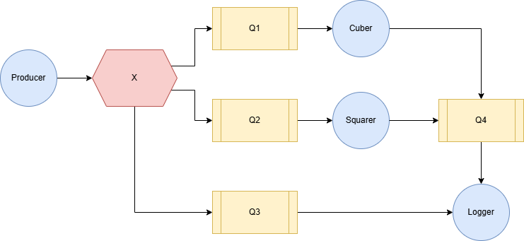

# Week 3 - Message Brokers

> Distributed and Networking Programming - Spring 2025

Your task for this lab is to use RabbitMQ as a message broker for the system on the picture:

1. **Yellow rectangles** - Queues. Transfer messages between applications
2. **Blue circles** - Applications.
    1. Producer
    2. Squarer
    3. Cuber
    4. Logger
3. **Red hexagon** - Fanout Exchange. Pushes a copy of incoming messages to queues

## Applications
### Producer
* Connect to RabbitMQ using the global credentials
* Declare a proper exchange type
* Publish messages
* Make messages persistent
* Include proper error handling

### Squarer/Cuber
* Connect to RabbitMQ
* Consume from the exchange
* Calculate squares/cubes of received numbers
* Publish results to another queue
* Implement proper message acknowledgment

### Logger
* Consume from both original numbers and processed queues
* Write log entries to rabbitmq_messages.log in format of `[{ISOtimestamp}] {publisher_name_of_producer} : {message_type}} : {number}`
