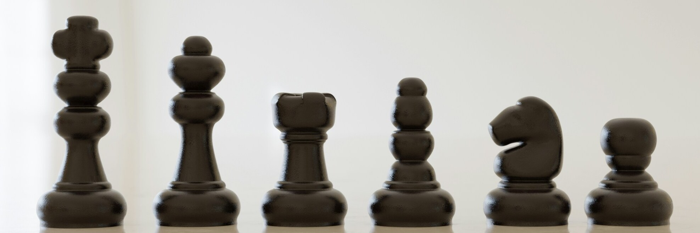

# Multiplayer Chess

<div align = center><br><br></div>

## Preparing for launch

1. Clone the repository:
```bash
git clone https://gitlab.pg.innopolis.university/i.isakov/multiplayer-chess.git
```

2. Install the dependencies:
```bash
pip install -r requirements.txt
```

3. Launching the app.
The application consists of a server and clients. To work, you must:
Start the server (in the first terminal):
```bash
python server.py
```
Wait for the server startup message in the logs.
Launch the first client (in the second terminal):
```bash
python client.py
```
Launch the second client (in the third terminal):
```bash
python client.py
```
## How to start the game
1. Register/Authorize all participating clients.
2. In the first client, click `Play`. Empty lobby will be opened, where `Create game` button should be clicked.
3. Open lobby in second client. A list of available games should appear in the second client (otherwise click `refresh`).
4. Select `Game 1` in the second client to connect to the game.